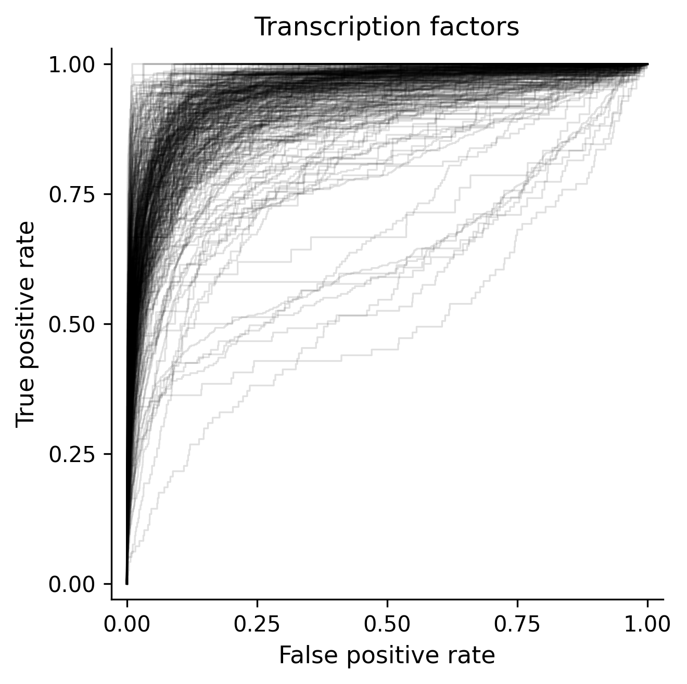

# DNA-CNN

A PyTorch implementation of the convolutional neural network architecture from **DeepSEA** (Zhou & Troyanskaya, 2015) for predicting genomic regulatory activity from DNA sequence.

## Overview

This project reproduces the DeepSEA CNN architecture in PyTorch and provides a complete data preparation and training pipeline.

The project includes an **ETL pipeline orchestrated with Snakemake** that:

- Downloads ChIP-seq data from the ENCODE API
- Cleans and filters genomic peak data
- Processes reference genome sequences
- Generates positive and negative training examples
- Prepares the resulting data for model training

The training pipeline was also optimized for GPU performance. On an **NVIDIA RTX 4050**, training time was reduced from approximately **7 minutes per epoch to 3 minutes per epoch**.

The resulting model achieves a **median ROC-AUC of 0.9406**.

## Results

### ROC-AUC by Target

**Overall ROC-AUC: 0.9406**

## Requirements

- Linux
- Conda
- [BedTools](https://bedtools.readthedocs.io/)
- [uv](https://docs.astral.sh/uv/)
- NVIDIA GPU recommended for training

## Installation

The data preparation pipeline requires BedTools. Create a Conda environment and install it:

    conda create -n dna-cnn bedtools
    conda activate dna-cnn

Then install the Python dependencies using `uv`:

    uv sync

## Usage

### 1. Prepare the dataset

Run the Snakemake pipeline:

    uv run snakemake --cores [N]

Replace `[N]` with the number of CPU cores you want to use.

The pipeline handles downloading, processing, filtering, and preparing the genomic data required for training.

### 2. Train the model

Once the dataset has been prepared:

    uv run main.py

### 3. Evaluate the model

Run the testing script:

    uv run testing.py

## Data Pipeline

The data preparation workflow is orchestrated using Snakemake:

    ENCODE API
         |
         v
      ChIP-seq data
         |
         v
    Filtering / cleaning
         |
         v
     Peak processing
         |
         +------------------+
         |                  |
         v                  v
    Positive peaks     Negative regions
         |                  |
         +--------+---------+
                  |
                  v
        DNA sequence extraction
                  |
                  v
          Training / testing data
                  |
                  v
             DeepSEA CNN

The pipeline is configured through `config.yaml` and the individual processing steps are implemented in `scripts/`.

## Project Structure

    .
    ├── Snakefile
    ├── config.yaml
    ├── main.py
    ├── testing.py
    ├── generate_non_peak_bed.py
    ├── pyproject.toml
    ├── uv.lock
    │
    ├── scripts/
    │   ├── download_beds.py
    │   ├── download_fasta.py
    │   ├── extract_negatives.py
    │   ├── extract_negatives_test.py
    │   ├── extract_positives.py
    │   ├── filter_and_id_targets.py
    │   ├── merge_beds.py
    │   ├── merge_tensors.py
    │   └── utils.py
    │
    ├── src/
    │   ├── dna_utils.py
    │   ├── load_data.py
    │   ├── model.py
    │   └── training.py
    │
    └── tests/
        ├── test_extract_negatives.py
        └── test_peak_clustering.py

## Performance

Training performance was optimized substantially during development.

| Hardware | Training time |
|---|---:|
| NVIDIA RTX 4050 — before optimization | ~7 min/epoch |
| NVIDIA RTX 4050 — after optimization | ~3 min/epoch |

This corresponds to an approximate **57% reduction in training time per epoch**.

## Model

The CNN architecture is based on **DeepSEA**, a deep learning model for predicting the effects of non-coding genetic variants from DNA sequence.

The original DeepSEA architecture was introduced by:

> Zhou, J. & Troyanskaya, O. G. (2015). Predicting effects of noncoding variants with deep learning-based sequence model. *Nature Methods*, 12, 931–934.

[DOI: 10.1038/nmeth.3547](https://doi.org/10.1038/nmeth.3547)

## Tests

The project includes tests for parts of the data preparation pipeline.

Run the test suite with:

    uv run pytest

## Reproducibility

The Python dependencies are locked using `uv.lock`, while the data preparation workflow is defined by the Snakemake `Snakefile` and `config.yaml`.

To reproduce the pipeline:

    conda create -n dna-cnn bedtools
    conda activate dna-cnn
    uv sync
    uv run snakemake --cores [N]

Then train and evaluate the model:

    uv run main.py
    uv run testing.py
